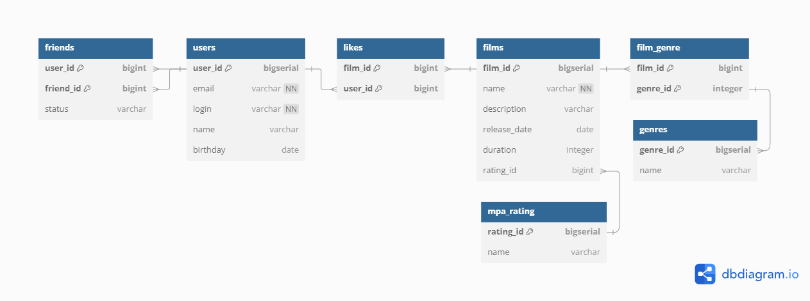

# java-filmorate

Схема базы данных


`friends` - таблица содержит информацию о статусе дружбы между двумя пользователями.

`users` - таблица содержит информацию о пользователях.

`likes` - содержит информацию о пользователях, которым понравился фильм.

`films` - таблица содержит информацию о фильмах.

`mpa_rating` - содержит информацию о рейтинге.

`film_genre` - содержит информацию о жанрах конкретного фильма.

`genres` - содержит информацию о жанрах.

# Примеры запросов к БД

Получение списка пользователей
```sql
SELECT * FROM users;
```
Добавление нового пользователя
```sql
INSERT INTO users (email, login, name, birthday)
VALUES ('mail@mail.ru', 'user', 'Иванов', '2000-01-01');
```
Получение списка друзей пользователя с id 1
```sql
SELECT u.login
FROM users as u
WHERE u.user_id = (SELECT friend_id FROM friends
              WHERE user_id = 1 AND status = 'Accepted');
```
Получение списка фильмов
```sql
SELECT * FROM films;
```
Удаление фильма с id 1
```sql
DELETE FROM films WHERE id = 1;
```
Получение списка 10 самых популярных фильмов
```sql
SELECT name
FROM films
WHERE film_id IN (SELECT film_id
                  FROM likes
                  GROUP BY film_id
                  ORDER BY COUNT(user_id) desc
                   LIMIT 10);
```


